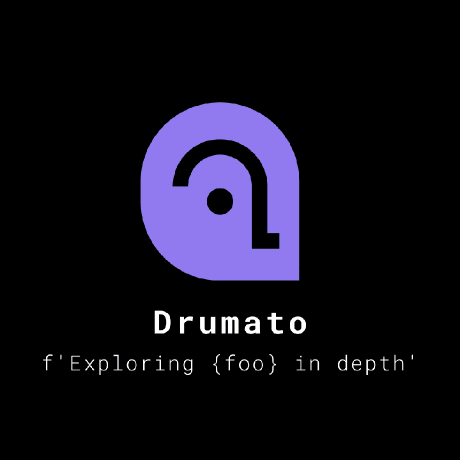

# Profile

- screenName: **Drumato**
- Language: Rust/Go/C/Haskell
- Occupation: Student
- Interests: CS/network/system programming/**entire of Software Engineering**

## Projects

- [Depth](https://github.com/Drumato/Depth)
  - develop **Compiler Driver** from scratch.
  - supports a programming langage designed by myself
  - contains compiler/x64 assembler/elf linker
  - it's written in Rust
  - Depth can emit LLVM IR(WIP)
  - can execute ELF binary with `--run` option without using `execve(2)`
  - can check whether a binary contains some security-mechanisms are in with `--checksec` flag.
  - contains `readelf-ish` program. `depth a.out --readelf -a | less -R` 
  - [finally i could create the ELF binary which is executable without using gcc](https://twitter.com/Drumato1/status/1186993979121754112?s=20)
- [Peachili](https://github.com/Drumato/Peachili)
  - develop **Compiler Driver** from scratch.
  - supports a programming langage designed by myself
  - it's written in Rust
- [asmpeach](https://github.com/Drumato/asmpeach)
  - An x64 assembler that is written by Rust
- [elfpeach](https://github.com/Drumato/elfpeach)
  - An TUI based ELF analyzer
- [elf-utilities](https://github.com/Drumato/elf-utilities)
  - ELF utilities written by Rust

## Activities

- seccamp2019 Y-Ⅱ Cコンパイラを自作してみよう! 受講生
  - [Report in Japanese](https://drumato.hatenablog.com/entry/2019/08/18/120154)
- SecHack365'19 Trainee
  - [Report in Japanese](https://drumato.hatenablog.com/entry/2019/12/08/000000)
  - [Report2 in Japanese](https://drumato.hatenablog.com/entry/2020/02/08/095501)
- サイボウズ･ラボユース生
- Online Summer Internship for Gophers 2020参加
  - [Report in Japanese](https://drumato.hatenablog.com/)
- KLab Expert Camp#3
- LINE IT Service Center Verda室 Network Development Team

## Miscellaneous

- Twitter(Japanese): [@Drumato](https://twitter.com/Drumato)
- GitHub: [@Drumato](https://github.com/Drumato)
- Blog(Japanese): [DrumatoのBlog](https://drumato.hatenablog.com/)
- SpeakerDeck: [Drumato](https://speakerdeck.com/drumato/cybozu-labs-youth-10th)
- Scrapbox: [drumato](https://scrapbox.io/drumato-medley/)
